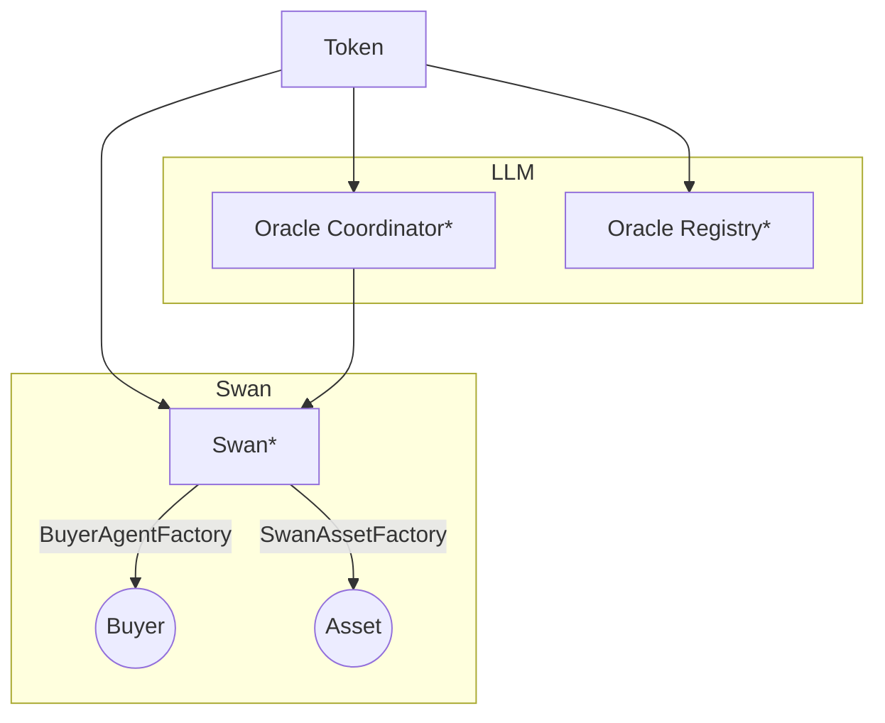

# Deployments & Upgrades

All Dria-related contract deployments are stored here, along with their upgrades.

In the diagram below, we see the relationship between contracts, where the upgradable ones are marked with `*` as well.



Note that although the `Token` contract is shared among its consumer contracts, it may be given separately at different addresses, hence for example **Oracle Coordinator** does not read the token address from **Oracle Registry**.

> [!TIP]
>
> All deployment information are stored under `deployments/<network-name>.json`

## Deployments

To deploy contracts, provide the contract name via `CONTRACT_NAME` env variable, and pass the network argument to Hardhat for the deployment script:

```sh
CONTRACT_NAME=<contract-name> npx hardhat --network <network-name> run ./scripts/deploy.ts
```

> [!NOTE]
>
> To deploy contracts on a `localhost`, first start the node in another terminal with:
>
> ```sh
> npx hardhat node
> ```

### Verification

All deployments on **non-local chains** are verified within the script right after their deployment!

In some cases you might want to verify contracts manually as well. For that, use `npx hardhat verify` command:

```sh
npx hardhat verify --network <network-name> <contract-address> [<constructor-args>...]
```

For example, manual verification is required for `BuyerAgent` and `SwanAsset` since they are deployed via factory contracts. Just verifying one contract is enough, since the block explorer (BlockScout) will verify through the bytecode matching afterwards.

#### BuyerAgent Verification

Since `BuyerAgent` is created with a factory, it must be manually verified (just once), later deployments will make use of the existing bytecode verification.

```sh
npx hardhat verify --network base-sepolia 0xd4bf3a67fdD302275e8DC6DD1300D4E2e0C09c2f 'Captain Nemo' '<backstory>A fish that wears a lab coat.</backstory><behaviour>Fish swims, and buys things that it can eat.</behaviour><objective>The fish only swims. It is not a captain either, people just call it that.</objective>' 10 10000000000000000 0x60A804A6b2c3a807794b34d63732E624e0AE2678 0x2aA47BC684aEC9093AB9E85c2CB19052887c1Aee
```

The first arguments are exactly as in `createBuyer`, and the last two addresses are Swan address and Swan's owner address.

## Upgrade

We use [OpenZeppelin Upgrades Plugin](https://docs.openzeppelin.com/upgrades-plugins/1.x/) for contract upgrades.
Make sure you have a contract in the `./contracts/mock` folder to upgrade to.

Upgrade contracts with:

```sh
CONTRACT_NAME=<contract-name> npx hardhat --network <network-name> run ./scripts/upgrade.ts
```

## Contract Sizes

To measure contract sizes you can use the following command:

```sh
npx hardhat size-contracts
```
